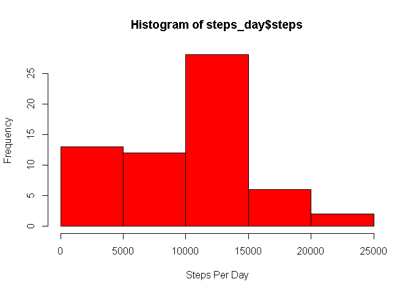
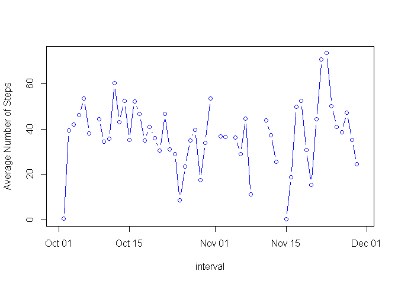

# Reproducible Research: Peer Assessment 1


## Loading and preprocessing the data

```r
data<- read.csv("activity.csv")
data_inform <- data [which(data$steps!= "NA"),]
```
## What is mean total number of steps taken per day?

```r
library(plyr)
steps_day <- ddply(data_inform, .(date), summarise, steps=sum(steps))
hist(steps_day$steps, xlab="steps per day")
```

 
## What is the average daily activity pattern?

```r
date_average <-ddply(data_inform, .(interval), summarise, steps=mean(steps))
plot(date_average$interval, date_average$steps,, xlab="5 minute interval", ylab="Average steps", main= "Average daily activity")
```

 

```r
date_average[date_average$steps==max(date_average$steps),]
```

```
##     interval    steps
## 104      835 206.1698
```

```r
colnames(date_average)[2] <- "intervalAvg"
```
## Imputing missing values

```r
sum(is.na(data$steps))
```

```
## [1] 2304
```

```r
merged <-arrange(join(data, date_average), interval)
```

```
## Joining by: interval
```

```r
merged$steps[is.na(merged$steps)] <- merged$intervalAvg[is.na(merged$steps)]
newsteps <- ddply(merged, .(date), summarise, steps=sum(steps))
hist(newsteps$steps, main="Number of Steps", xlab="steps taken each day",,)
```

 

```r
mean(newsteps$steps)
```

```
## [1] 10766.19
```

```r
median(newsteps$steps)
```

```
## [1] 10766.19
```

```r
steps_day_1 <- sum(data_inform$steps)
steps_day_2 <- sum(merged$steps)
diff <- steps_day_2 -steps_day_1 []
```
## Are there differences in activity patterns between weekdays and weekends?

```r
library(lattice)
weekdays <- weekdays(as.Date(merged$date))
data_weekdays <- transform(merged, day=weekdays)
data_weekdays$wk <- ifelse(data_weekdays$day %in% c("Saturday","Sunday"),"weekend","weekday")
averageweek <-ddply(data_weekdays, .(interval,wk), summarise, steps=mean(steps))
xyplot(steps ~ interval | wk, data = averageweek, layout = c(1,2), type="1")
```

 


