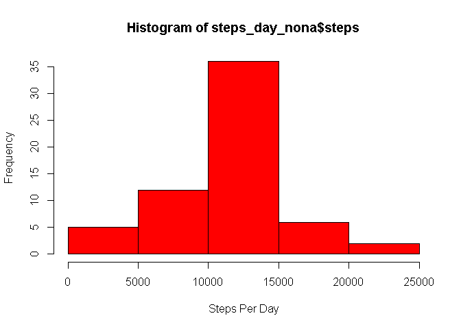
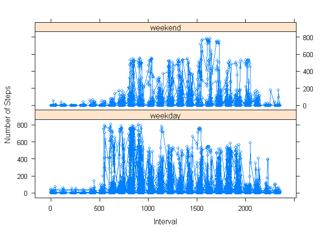

# Reproducible Research: Peer Assessment 1


## Loading and preprocessing the data

```r
library(lubridate)
library(dplyr)
```

```
## 
## Attaching package: 'dplyr'
## 
## The following objects are masked from 'package:lubridate':
## 
##     intersect, setdiff, union
## 
## The following objects are masked from 'package:stats':
## 
##     filter, lag
## 
## The following objects are masked from 'package:base':
## 
##     intersect, setdiff, setequal, union
```

```r
library(tidyr)
library(plyr)
```

```
## -------------------------------------------------------------------------
## You have loaded plyr after dplyr - this is likely to cause problems.
## If you need functions from both plyr and dplyr, please load plyr first, then dplyr:
## library(plyr); library(dplyr)
## -------------------------------------------------------------------------
## 
## Attaching package: 'plyr'
## 
## The following objects are masked from 'package:dplyr':
## 
##     arrange, count, desc, failwith, id, mutate, rename, summarise,
##     summarize
## 
## The following object is masked from 'package:lubridate':
## 
##     here
```

```r
unzip('repdata_data_activity.zip')
activity <-read.csv("activity.csv", header=TRUE, sep=",")
dates_converted <-as.Date(activity$date,format="%Y-%m-%d")
activity$date <- dates_converted
```
## What is mean total number of steps taken per day?

```r
grouped_by_dates <- group_by(activity, date)
steps_day <- summarise_each(grouped_by_dates,funs(sum(steps,na.rm=TRUE)))
hist(steps_day$steps, xlab= "Steps Per Day", col="red")
```

 

```r
sum <-summarise(grouped_by_dates, mean(steps),median(steps))
```
## What is the average daily activity pattern?

```r
steps_average <- summarise_each(grouped_by_dates,funs(mean(steps,na.rm=TRUE)))
plot(steps_average$date,steps_average$steps,ylab= "Average Number of Steps", xlab= "interval", type="b", col="blue")
```

 
##In plot above, tried to use type "1" but would not work, for all intensive purposes types b will suffice 

## Imputing missing values

#1. Reporting Number of Missing Values

```r
na <- nrow(activity)
nona <- nrow(na.omit(activity))
totalnas <- na - nona
totalnas
```

```
## [1] 2304
```
#2. Creating a new dataset with the Imputed Missing Values

```r
stepsmean <- mean(activity$steps, na.rm=TRUE)
activity_nona <- activity
activity_nona$steps[is.na(activity_nona$steps)] <- stepsmean
```

#4. Making a histogram just like above, but with the new dataset

```r
grouped_by_dates_nona <- group_by(activity_nona, date)
steps_day_nona <- summarise_each(grouped_by_dates_nona, funs(sum(steps, na.rm=TRUE)))
hist(steps_day_nona$steps, xlab= "Steps Per Day", col="red")
```

 

```r
sum_nona <-summarise(grouped_by_dates_nona, mean(steps),median(steps))
sum_nona
```

```
##   mean(steps) median(steps)
## 1     37.3826             0
```
## Strategy for filling NA's obviously skews the median


## Are there differences in activity patterns between weekdays and weekends?

```r
library(lattice)
weekdays <- weekdays(activity$date)
activity$day <- weekdays
activity$Week_or_Weekend <- ifelse(activity$day %in% c("Saturday","Sunday"),"weekend","weekday")
activity_patterns <-group_by(activity, date,interval,Week_or_Weekend)
activity_patterns <-summarise_each(activity_patterns, funs(sum(steps, na.rm=TRUE)))
xyplot(activity_patterns$steps ~ activity_patterns$interval | activity_patterns$Week_or_Weekend, layout= c(1,2), type="b", xlab = "Interval", ylab= "Number of Steps")
```

 
